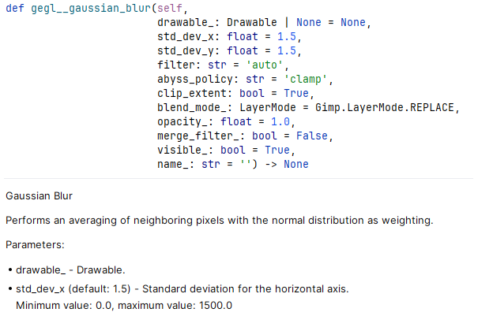

# Wrappers for GIMP Python Plug-ins

This project aims to improve development of Python plug-ins for [GIMP 3](https://www.gimp.org/) by providing the following:

* A simplified means to call GIMP plug-ins and apply layer effects (GEGL operations):
  ```
  ...
  pdb.plug_in_jigsaw(image=image, drawables=[layer])
  ...
  pdb.gegl__gaussian_blur(layer, std_dev_x=5.0, std_dev_y=4.0, abyss_policy='clamp')
  ...
  ```

* A stub file that can be used in integrated development environments (IDEs), such as [PyCharm](https://www.jetbrains.com/help/pycharm/stubs.html), to display code completion suggestions and documentation for plug-ins and layer effects as you type.

* A simplified means to register Python plug-ins.
  * [Example](https://github.com/kamilburda/gimp-python-wrappers/blob/5.2/generate-pdb-stubs/generate-pdb-stubs.py#L52)
  * [Documentation](https://github.com/kamilburda/gimp-python-wrappers/blob/5.2/wrappers/procedure.py#L26)


## Requirements

* GIMP 3.0.0 or later
* Python 3.9 or later


## Usage in Python Plug-ins 

There are two main components that you can integrate into your Python plug-in:
* `pdb` object that allows calling GIMP plug-ins and layer effects (GEGL operations).
* `procedure` module that allows registering a plug-in procedure with a single function.

These components are independent of each other, i.e. you can use one without the other if you wish.


### Using `pdb` to call plug-ins and layer effects

The `pdb` object from the `pypdb` module is used to invoke GIMP plug-ins and layer effects (technically speaking: GEGL operations). `pdb` stands for the GIMP Procedural Database (PDB), which stores all available plug-ins and procedures.

You can also use the `pdb` object to call built-in GIMP procedures which are normally accessible via the `Gimp` module.

#### Installation

Place the `wrappers/pypdb.py` and `wrappers/pypdb.pyi` files in the same subdirectory within your Python plug-in.

Example:

```
<directory containing GIMP plug-ins>/
    some-plug-in/
        some-plug-in.py
        pypdb.py
        pypdb.pyi
```

IDEs supporting the `.pyi` stub files should now display suggested functions as you type. Stub files are supported by several IDEs such as [PyCharm](https://www.jetbrains.com/help/pycharm/stubs.html), [PyDev](https://www.pydev.org/manual_101_install.html) (an Eclipse plug-in) or [Visual Studio Code via a plug-in](https://marketplace.visualstudio.com/items?itemName=ms-python.vscode-pylance). Example for PyCharm: 




If you use git as your versioning system, add `.pyi` to your `.gitignore` so that git ignores stub files.

#### Usage

Example of using the `pdb` object in a GIMP Python plug-in:

```
from pypdb import pdb


def run_plugin(procedure, run_mode, image, drawables, config, data):
    ...
    pdb.plug_in_jigsaw(image=image, drawables=[layer])
    ...
    pdb.gegl__gaussian_blur(layer, std_dev_x=5.0, std_dev_y=4.0, abyss_policy='clamp')
    ...
```

Alternatively, you can call the functions via strings:

```
    pdb['plug-in-jigsaw'](image=image, drawables=[layer])
    ...
    pdb['gegl:gaussian-blur'](layer, std_dev_x=5.0, std_dev_y=4.0, abyss_policy='clamp')
    ...
```

The names of layer effects (GEGL operations) start with a word followed by a `__`, usually `gegl__` or `svg__`.
The `-` and `:` characters in the original names of the functions are replaced with `_` and `__`, respectively.

Function arguments can only be specified as keyword arguments (`<argument name>=<value>`).
The only positional argument allowed is a `Gimp.Layer` object as the first argument, and only for layer effects.

You can omit any arguments, in which case their default values will be used.
Note, however, that omitting some arguments may result in an error, e.g. if a function requires an image or a layer that is left unspecified.

All layer effects have the following common parameters (all of them end with `_` to avoid possible name clashes with other parameters):
* `blend_mode_` - the `Gimp.LayerMode` for the effect (default, dodge, burn, hard light, ...).
* `opacity_` - the opacity of the effect.
* `merge_filter_` - if ``True``, the effect will be applied destructively, i.e. will be merged into the layer.
* `visible_` - if ``False``, the effect will be added, but will not be applied.
* `filter_name_` - a custom name for the effect. If omitted, a default name is assigned by GIMP.

In the marginal case that an argument name matches a Python keyword (e.g. `lambda`), append a `_` (e.g. `lambda_`) to avoid a syntax error.

Return values are returned as a Python list (in case of multiple return values) or directly as a Python object (in case of a single return value). Functions having no return values return `None`.

The exit status is available as the `pdb.last_status` property (in the official GIMP API, this is a part of the returned `Gimp.ValueArray` as the first element). This does not apply to layer effects.

The `pdb.last_error` attribute contains an error message if the last function called via `pdb` failed. Likewise, this does not apply to layer effects.


### Registering your Python plug-in with `procedure`

Place the `wrappers/procedure.py` file in the same subdirectory within your Python plug-in.

Example:

```
<directory containing GIMP plug-ins>/
    some-plug-in/
        some-plug-in.py
        procedure.py
```

Within the main file of your plug-in (a Python script with same name as its parent directory) import the `procedure` module and call `procedure.register_procedure()` to register a single plug-in procedure. See the bottom of the [`generate-pdb-stubs` module](generate-pdb-stubs/generate-pdb-stubs.py) for an example. The `procedure.register_procedure()` function documentation contains details on the parameters and how they must be formatted.

At the end of your main Python file (`some-plug-in.py` in the example above), call `procedure.main()`.

For some argument/return value types, e.g. `Gegl.Color`, the default value can be a valid `Gegl.Color` object. In that case, you must call `Gegl.init()` first before instantiating the default objects as otherwise plug-in registration will fail (the plug-in will crash). Alternatively, you can pass a function returning a list to the `arguments` parameter rather than the list itself to delay the creation of the default values until it's necessary, at which point `Gegl.init()` will have been automatically called already.


## Regenerating the `pypdb.pyi` stub file

While this repository provides a pre-generated stub file for the `pdb` object, it may quickly become obsolete in future versions of GIMP and does not display hints for custom plug-ins and scripts you have installed.
In such cases, you may want to generate the stub file yourself as described below.

To generate a new stub file, this repository must be installed as a GIMP plug-in.

1. Locate the directory for plug-ins in your GIMP installation by going to `Edit → Preferences → Folders → Plug-Ins`.
2. Choose one of the listed directories there (preferably the one located under a user directory rather than the system directory) and copy the `gimp-python-wrappers` directory to one of the directories listed in step 1.
3. If you have GIMP opened, restart GIMP.

To run the stub generator, open GIMP and choose `Filters → Development → Python-Fu → Generate GIMP PDB Stubs for Python`.

You may adjust the output directory.

Alternatively, you can run the generator from the Python-Fu console - choose `Filters -> Development -> Python-Fu -> Python Console` and enter

```
procedure = Gimp.get_pdb().lookup_procedure('generate-pdb-stubs')
config = procedure.create_config()
config.set_property('output-directory', Gio.file_new_for_path(<path to directory>))
procedure.run(config)
```
